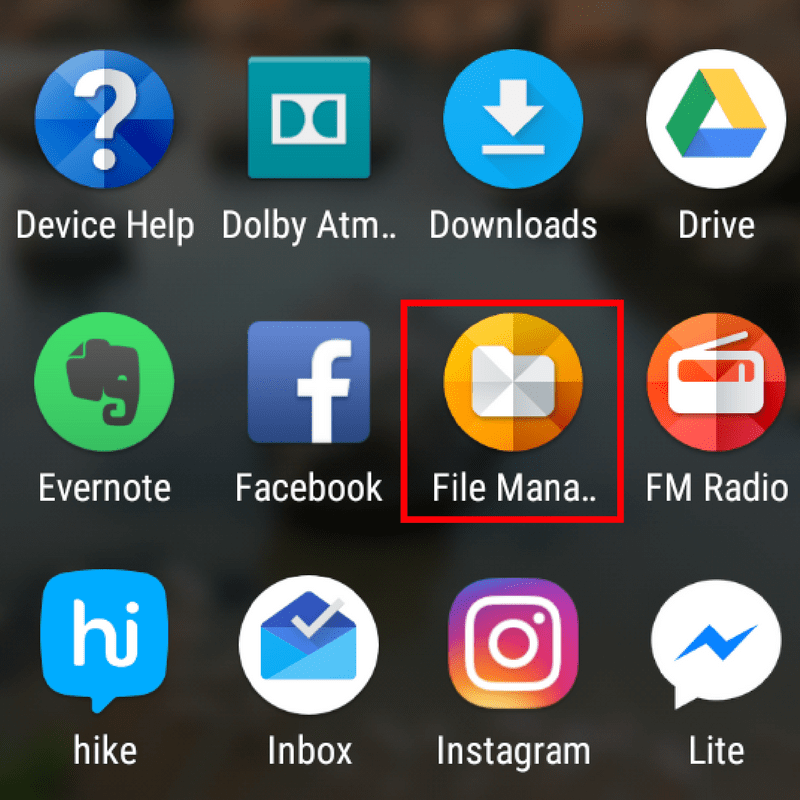
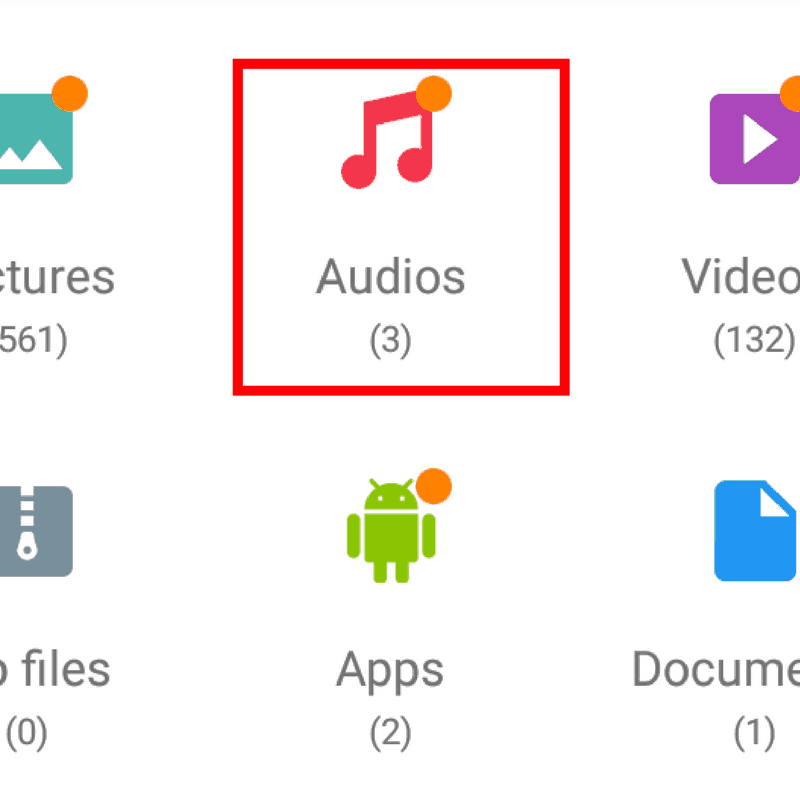
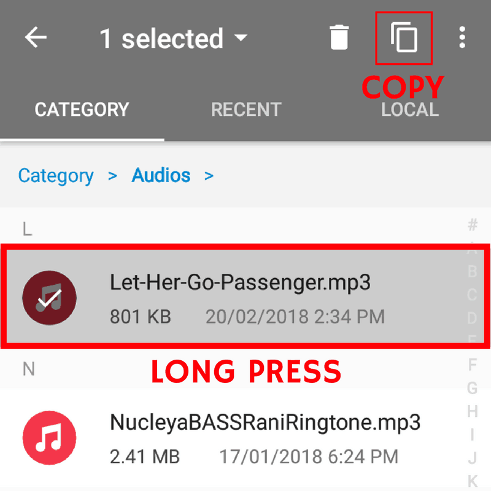
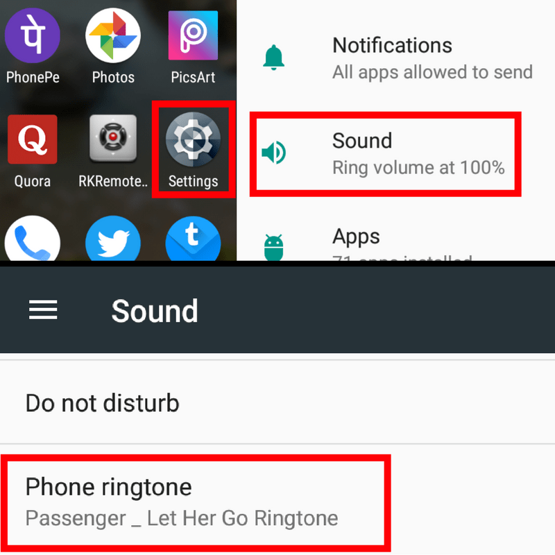
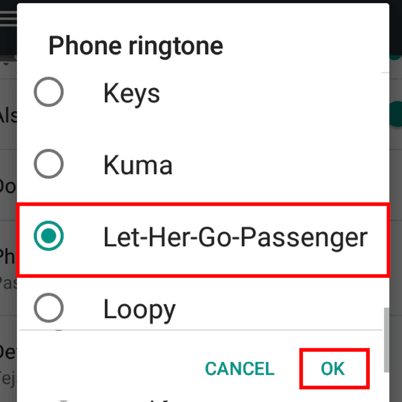

  Moto G5 Plus is one of the best selling smartphones in India. It is a great
  value phone in the limited budget segment. Some people find difficulties in
  customising their Moto G5 Plus according to their preferences. Setting a
  custom Ringtone is a part of customizing your smartphone. Today we are going
  to share with you step by step guide on How to set Ringtone in Moto G5 Plus.

<h2>
  <strong>
    How to set Ringtone in Moto G5 Plus without any third party apps
  </strong>
</h2>

  If you want to set custom Ringtone in Moto G5 Plus without any third party
  apps, Then here is a simple method to set Ringtone in Moto G5 Plus. Moto G5
  Plus and Moto G5 run on Android 7.1.1. The UI on both devices are identical.
  So you can also set custom ringtone in Moto G5 using this method.

  <strong>
    1. First, download or save the Ringtone you want to set to your Moto G5
    Plus. It is fine if you have the music file on microSD card.
  </strong>

  <strong>2. Now open the file manager.</strong>

  

  <strong>
    3. Find the folder where the ringtone is saved(you can also find it under
    Audios section).
  </strong>

  

  <strong>
    4. Copy the file by long pressing the file and then tap on copy
    button(overlapping square box button left to three vertical dots.) which is
    at the top.
  </strong>

  

  <strong>
    5. Now go to the folder Local-&gt;Internal storage-&gt;Ringtones.
  </strong>

  <strong>6. Paste your Ringtone here.  </strong>

  

 

  <strong>7. Now go to Settings-&gt;Sound-&gt;Phone Ringtone.</strong>

  

  <strong>
    8. Choose your Ringtone from the list which you want it as default phone
    Ringtone.
  </strong>

  

  <strong>9. Click on OK and you're done! The Ringtone will be set!</strong>

  also read: 
  <a
    href="https://rishitpatel.com/how-to-set-ringtone-in-moto-e4-plus/"
    target="_blank"
    rel="noopener noreferrer"
  >
    How to set Ringtone in Moto E4 Plus
  </a>

<h2>
  <strong>How to set Ringtone in Moto G5 Plus using third-party apps</strong>
</h2>

  If you are having any difficulties in following the above method, then there
  is another simple method to set Ringtone in Moto G5 Plus. You can set custom
  Ringtone in Moto G5 Plus using a third-party app called{" "}
  <a href="https://goo.gl/N3RA8g" target="_blank" rel="noopener noreferrer">
    ES File Explorer
  </a>
  . You can download it by clicking <a
    href="https://goo.gl/N3RA8g"
    target="_blank"
    rel="noopener noreferrer"
  >
    here
  </a>. after downloading <a
    href="https://goo.gl/N3RA8g"
    target="_blank"
    rel="noopener noreferrer"
  >
    ES File Explorer
  </a>, Follow the steps mentioned below to set Ringtone in Moto G5 Plus. Again,
  you can also use this method to set Ringtone in Moto G5. because the UI on both
  devices are identical.

<ul>
  <li>
    <strong>Go to the Setting-&gt;Sound-&gt;Phone Ringtone.</strong>
  </li>
  <li>
    <strong>Select ES file explorer to open.</strong>
  </li>
  <li>
    <strong>
      Browse to the location where your desired Ringtone is saved.
    </strong>
  </li>
  <li>
    <strong>Click on OK and you're done! The Ringtone will be set!</strong>
  </li>
</ul>

  also read: 
  <a
    title="How to take screenshot on Honor 7x"
    href="https://rishitpatel.com/how-to-take-screenshot-on-honor-7x/"
    target="_blank"
    rel="bookmark noopener noreferrer"
  >
    How to take screenshot on Honor 7x
  </a>

<h2>
  <strong>
    How to make custom Ringtone and set it as Ringtone in Moto G5 Plus using
    third-party apps
  </strong>
</h2>

  Do you know you can make your own custom Ringtones? You can make your own
  custom Ringtone from a song using 
  <a
    href="https://play.google.com/store/apps/details?id=com.atomic.apps.ringtone.cutter&amp;hl=en"
    target="_blank"
    rel="noopener noreferrer"
  >
    MP3 Cutter and Ringtone Maker
  </a>. You can download it by clicking <a
    href="https://play.google.com/store/apps/details?id=com.atomic.apps.ringtone.cutter&amp;hl=en"
    target="_blank"
    rel="noopener noreferrer"
  >
    here
  </a>. after downloading 
  <a
    href="https://play.google.com/store/apps/details?id=com.atomic.apps.ringtone.cutter&amp;hl=en"
    target="_blank"
    rel="noopener noreferrer"
  >
    MP3 Cutter and Ringtone Maker
  </a>
  , You can make your own Ringtone and set it as default Ringtone in Moto G5 Plus
  by following step by step method shown below. As mentions before UI on Moto G5
  Plus and Moto G5 are identical, So, you can also use this method for Moto G5 and
  any other Moto or Android Smartphone.

<ul>
  <li>
    <strong>
      Download &amp; open 
      <a
        href="https://play.google.com/store/apps/details?id=com.atomic.apps.ringtone.cutter&amp;hl=en"
        target="_blank"
        rel="noopener noreferrer"
      >
        MP3 Cutter and Ringtone Maker
      </a>.
    </strong>
  </li>
  <li>
    <strong>Tap on Cut a Song/Music.</strong>
  </li>
  <li>
    <strong>Tap on a song you want to make Ringtone of.</strong>
  </li>
  <li>
    <strong>Cut the song according to your preference.</strong>
  </li>
  <li>
    <strong>Tap on save button on top after cutting the song.</strong>
  </li>
  <li>
    <strong>Save it as Ringtone type by clicking on 'save'.</strong>
  </li>
  <li>
    <strong>
      Tap on 'MAKE DEFAULT' &amp; you're done! The Ringtone will be set!
    </strong>
  </li>
</ul>

  Share this post with your friends and family if it helped you. If you're
  facing any issue related to this or anything else on our website then feel
  free to contact!

