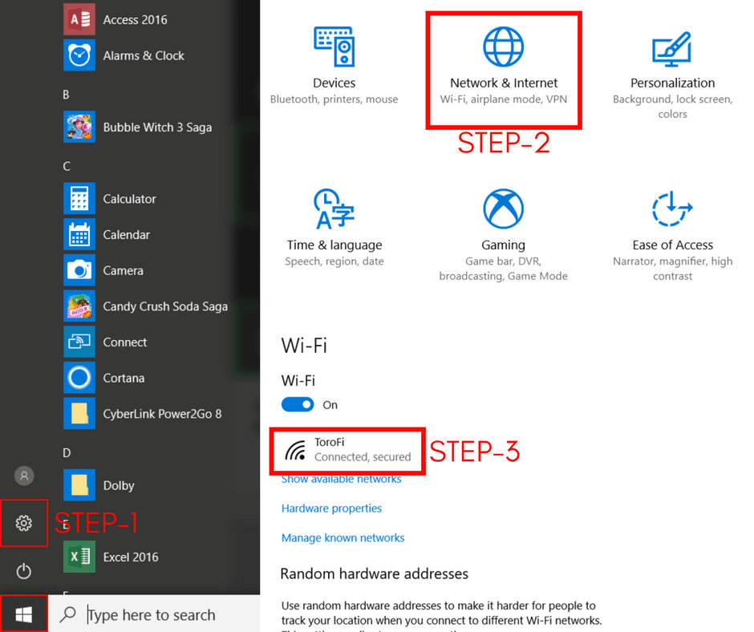
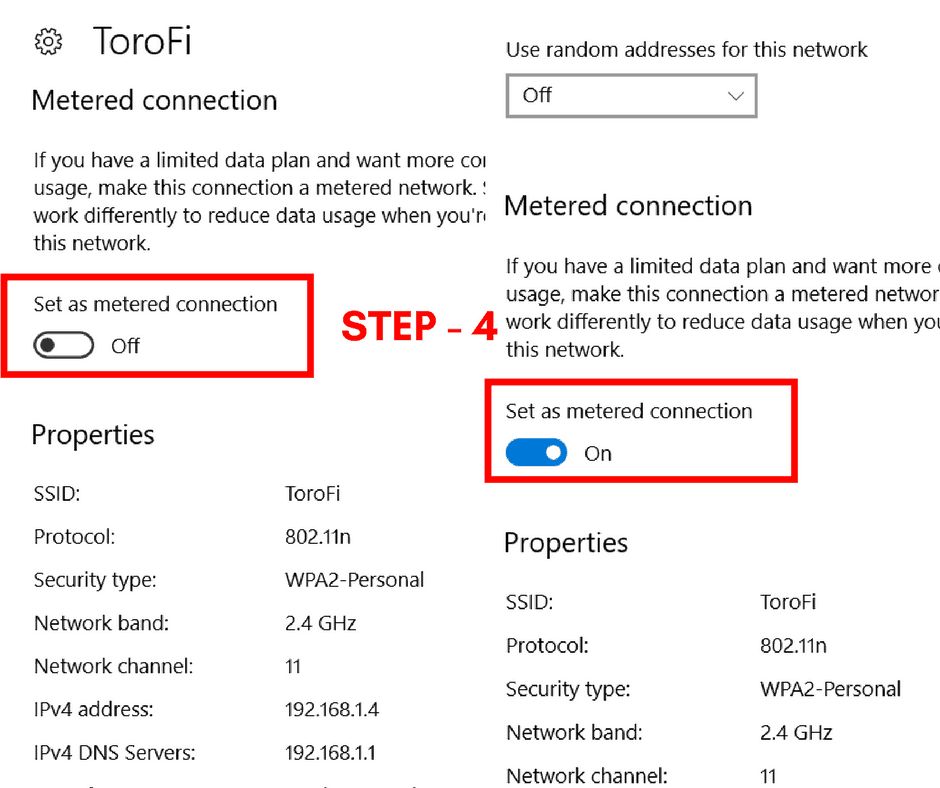

If you use Windows 10 you would know that Microsoft has made it mandatory for Windows 10 users to update their computer. Windows 10 Pro users have an option to delay the updates they receive, but Windows 10 Home users don't have that option. Automatic updates in Windows 10 are good for both users and <a href="http://amzn.to/2FfM5Qu" target="_blank">computer</a> as it makes your pc more secure and improves the user experience. But honestly, it sucks. And most of users don't know **how to stop automatic updates in Windows 10.**

There is no greater Windows 10 controversy than its policy of forced updates. It's because not everybody has a broadband with decent speed and unlimited data usage. There are many other considerable issues like it slows down the <a href="http://amzn.to/2FfM5Qu" target="_blank">computer</a> while it's updating and it sometimes crashes the <a href="http://amzn.to/2FfM5Qu" target="_blank">computer</a> and many more. So because of this issues, many users want to **stop automatic updates in Windows 10.**

Regardless of why you want to delay or block Windows from automatically updating your <a href="http://amzn.to/2FfM5Qu" target="_blank">computer</a>, there are a couple of simple tricks that could do the job for you. Here is a method of how to stop automatic updates in Windows 10.

also read: [How to set Ringtone in Moto E4 Plus](https://rishitpatel.com/how-to-set-ringtone-in-moto-e4-plus/)

## **How to stop automatic updates in Windows 10 by metered connection**

The easiest and simplest way to stop automatic updates in Windows 10 is to use a metered Internet connection. This method stops automatic updates for certain Wi-Fi network. Here is the step-by-step method to set up a metered connection.

**1.** **Open the Settings app.** Go to Start button and select the Settings gear. You can also use the keyboard shortcut by pressing ⊞Win+I together to open Settings.

**2\. Click on Network & Internet.**

**3\. Select the Wi-Fi connection you connected to.**

**4.** Toggle ‘**Set as metered connection**’ button to ‘**On**’

