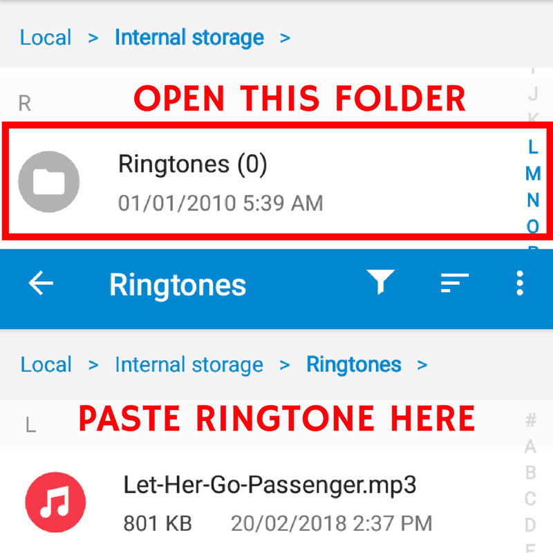

import Image from "../../components/image"

<Image />

# h1 Heading 8-)

## h2 Heading

### h3 Heading

#### h4 Heading

##### h5 Heading

###### h6 Heading

## Horizontal Rules

---

---

---

## Typographic replacements

Enable typographer option to see result.

(c) (C) (r) (R) (tm) (TM) (p) (P) +-

test.. test... test..... test?..... test!....

!!!!!! ???? ,, -- ---

"Smartypants, double quotes" and 'single quotes'

## Emphasis

**This is bold text**

**This is bold text**

_This is italic text_

_This is italic text_

~~Strikethrough~~

## Blockquotes

> Blockquotes can also be nested...
>
> > ...by using additional greater-than signs right next to each other...
> >
> > > ...or with spaces between arrows.

## number 2

> Blockquote checking with long text about something lorem like. Blockquotes can also be nested... ...by using additional greater-than signs right next to each other... ...by using additional greater-than signs right next to each other... ...by using additional greater-than signs right next to each other...

## Lists

Unordered

- Create a list by starting a line with `+`, `-`, or `*`
- Sub-lists are made by indenting 2 spaces:
  - Marker character change forces new list start:
    - Ac tristique libero volutpat at
    * Facilisis in pretium nisl aliquet
    - Nulla volutpat aliquam velit
- Very easy!

Ordered

1. Lorem ipsum dolor sit amet
2. Consectetur adipiscing elit
3. Integer molestie lorem at massa

1) You can use sequential numbers...
1) ...or keep all the numbers as `1.`

Start numbering with offset:

57. foo
1. bar

## Code

Inline `code`

`Long code to see`

Indented code

    // Some comments
    line 1 of code
    line 2 of code
    line 3 of code

Block code "fences huu"

```jsx
const user = {
  id: 3,
  name: "Ron",
  organization: {
    name: "Parks & Recreation",
    city: "Pawnee",
  },
}

console.log(updatedUser)
```

Syntax highlighting

```js {8}
var foo = function (bar) {
  // Comment Very very very very log comment Comment Very very very very log commentComment Very very very very log comment Comment Very very very very log comment
  /* comment */
  bar = 2
  return bar++
}

console.log(foo(5))
```

## Tables

| Option | Description                                                               |
| ------ | ------------------------------------------------------------------------- |
| data   | path to data files to supply the data that will be passed into templates. |
| engine | engine to be used for processing templates. Handlebars is the default.    |
| ext    | extension to be used for dest files.                                      |

Right aligned columns

| Option |                                                               Description |
| -----: | ------------------------------------------------------------------------: |
|   data | path to data files to supply the data that will be passed into templates. |
| engine |    engine to be used for processing templates. Handlebars is the default. |
|    ext |                                      extension to be used for dest files. |

## Links

[link text](http://dev.nodeca.com)

[link with title](http://nodeca.github.io/pica/demo/ "title text!")

Autoconverted link https://github.com/nodeca/pica (enable linkify to see)

## Images


<div style="max-width: 300px; text-align: center;">
  
</div>

Like links, Images also have a footnote style syntax

![Alt text][id]
